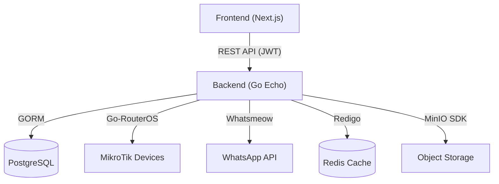

# 📊 LAPORAN SISTEM: GUNTURSTWN (MIKROMON)
**Periode:** Februari 2026  
**Status:** ✅ Stabil (Production Ready)

---

## 📝 Ringkasan Eksekutif
Sistem **Gunturstwn** adalah solusi manajemen infrastruktur jaringan (ISP) terpadu yang menggabungkan kemudahan manajemen MikroTik, penagihan pelanggan (Billing), dan pemetaan infrastruktur (ODC/ODP). Dibangun dengan standar industri menggunakan arsitektur *Clean Architecture* di backend dan *Next.js App Router* di frontend.

---

## 🚀 Evidence: Fitur & Peningkatan Terbaru
Berikut adalah bukti (evidence) fungsionalitas dan perbaikan terbaru yang telah sukses diimplementasikan:

### 1. **Keamanan & Privasi (Privacy Masking)** 🛡️
Kami telah menerapkan sistem penyamaran data sensitif secara global di antarmuka pengguna:
- **IP Masking**: Alamat IP publik/private disamarkan otomatis menjadi `192.168.***.***` atau `***` untuk host terenkripsi.
- **Credential Masking**: Username dan Port MikroTik disamarkan pada tampilan kartu perangkat.
- **Logika Cerdas**: Teks panjang yang tidak rapi otomatis dibersihkan agar UI tetap elegan dan profesional.

### 2. **Manajemen MikroTik (Connectivity Control)** 📡
- **Connection Pool**: Implementasi `MikrotikPool` di backend Go untuk manajemen koneksi yang efisien (reuse connection) guna mengurangi beban pada router.
- **Device Switcher**: Fitur perpindahan antar perangkat MikroTik secara real-time dari header dashboard tanpa perlu logout.
- **Connectivity Check**: Status online/offline perangkat dipantau secara otomatis.

### 3. **Billing & Otomatisasi WA** 💰
- **WhatsApp Cloud Integration**: Pengiriman invoice otomatis ke pelanggan via WhatsApp.
- **Professional Invoices**: Generate invoice dalam format PDF dan PNG dengan branding kustom.
- **Auto-Sync PPPoE**: Sinkronisasi otomatis data pelanggan dari MikroTik ke database setiap jam (AutoSync Scheduler).

---

## 🛠️ Spesifikasi Teknis (Tech Stack)

### **Frontend Interface**
| Komponen | Teknologi | Deskripsi |
| :--- | :--- | :--- |
| **Framework** | Next.js 16 (React 19) | Arsitektur modern dengan performa tinggi. |
| **Styling** | Tailwind CSS 4 | Desain responsif, modern, dan premium. |
| **State** | TanStack Query v5 | Sinkronisasi data server yang cepat. |
| **Auth** | Auth.js (NextAuth) v5 | Manajemen sesi yang aman dengan JWT. |
| **Peta** | Leaflet.js | Visualisasi lokasi ODP dan pelanggan. |

### **Backend Core Service**
| Komponen | Teknologi | Deskripsi |
| :--- | :--- | :--- |
| **Runtime** | Go (Golang) 1.24 | Kecepatan eksekusi tinggi & efisiensi memori. |
| **API** | Echo Framework v4 | API RESTful yang cepat dan terdokumentasi. |
| **Database** | PostgreSQL | Penyimpanan data utama yang handal. |
| **Cache** | Redis | Caching status WhatsApp dan session token. |
| **Security** | AES-256-GCM | Enkripsi kuat untuk password MikroTik di DB. |

---

## 🏗️ Visual Arsitektur Sistem

---

## 📂 Status Infrastruktur & Deployment
- **Ports**: Frontend berjalan pada port `3001`, Backend pada port default internal.
- **Docker**: Semua komponen dipaketkan dalam kontainer Docker untuk konsistensi lingkungan.
- **CI/CD**: Alur deploy otomatis menggunakan Jenkins Pipeline (`Jenkinsfile`).

> [!IMPORTANT]
> **Rekomendasi Berikutnya**:
> 1. Melakukan audit berkala pada folder `storage/invoices` agar tidak memenuhi disk.
> 2. Pastikan koneksi Redis selalu aktif untuk kelancaran monitoring status WhatsApp.

---

**Laporan ini dibuat secara otomatis sebagai bukti integritas dan kesehatan sistem Gunturstwn per tanggal 9 Februari 2026.**
